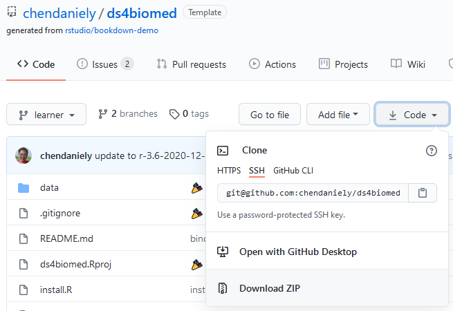
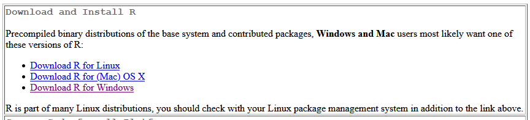
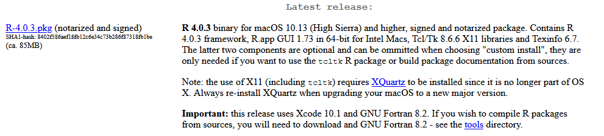
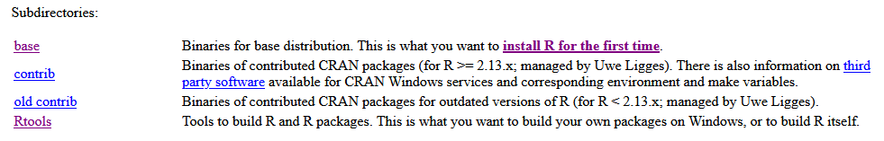
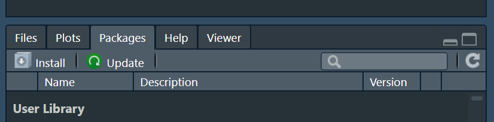
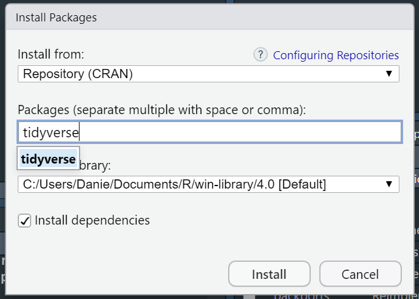
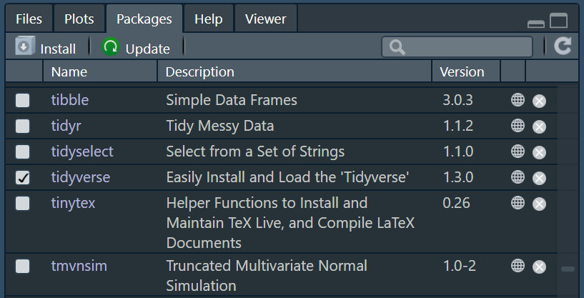



To prepare to follow along, you will need to have
the datasets downloaded and a programming language (e.g., R) installed.

## Download files
You need to download some files to follow this course.

<!--
1. Download <a href="https://laitanawe.github.io/introscicomp/data/shell-lesson-data.zip">shell-lesson-data.zip</a> and move the file to your home directory.
2. Unzip/extract `shell-lesson-data.zip`
-->
1. Data for the class examples can be found at the following location:
`/data/hps/assoc/private/rsc_intro_r/ds4biomed`

2. You can use the following commands to copy the data. If you want to highlight this command and copy, do not highlight the prompt or `$` at the beginning of the command:
    ~~~
    $ cp -Rv /data/hps/assoc/private/rsc_intro_r/ds4biomed /data/hps/assoc/private/rsc_intro_r/user/$USER
    ~~~
    {: .language-bash}

    ~~~
    $ ls /data/hps/assoc/private/rsc_intro_r/user/$USER/ds4biomed/intro/
    ~~~
    {: .language-bash}

    ~~~
    data  ds4biomed.Rproj environment.yml   install.R   README.md   runtime.txt
    ~~~
    {: .output}

    ~~~
    $ cd /data/hps/assoc/private/rsc_intro_r/user/$USER/ds4biomed/intro/
    ~~~
    {: .language-bash}

**Let your instructor know if you need help with this step**.
You should end up with the folder called **`ds4biomed`** under your user directory for the class.
You should also end up with some files within the folder **`intro`** under the ds4biomed directory in your user directory for the class.

### Associations on the Cluster
An Association is a managed shared workspace on Sasquatch that ensures reliable compute access, consistent software environments, and efficient collaboration and storage management. This is especially good for group projects and classes like this one.

Why create association for this Linux class?
- Shared file system and resources, primarily:  When/if the cluster reaches high load, you may not have compute resources available during class time.  We'll need to use resource reservations to address this issue, and tying it with an Association is the easiest method to enable this.

## Datasets (if using a personal comp) {-}

You can also find all the datasets needed from the workshop [from the book's GitHub Page](https://github.com/chendaniely/ds4biomed).

1. You can click on the "Code" dropdown and select "Download Zip" to download the data and files for the lesson materials.

    

2. Go to your Downloads folder to locate the `ds4biomed-learner` folder.  
3. Move this folder onto your Desktop and unzip it if it is still zipped.  

## Programming language {-}

R is a programming language that is especially powerful for data exploration, visualization, and statistical analysis. To interact with R, we use RStudio.

### R {-}

We will be using R and RStudio for the workshop.
If you would like a video installation tutorial,
please see the
[R section of The Carpentries workshop template](https://carpentries.github.io/workshop-template/#r).

The links to install R can be found here: https://cloud.r-project.org/.
Navigate to the correct operating system.

For mac users, download the `.pkg` file under the "Latest release" section

For Windows users, please install both the `base` version as well as `Rtools`.

#### RStudio {-}

After you have installed R, you can install RStudio.
We will use RStudio as the integrated development environment (IDE) to write and work with R code.
Rstudio can be downloaded from the following location: https://rstudio.com/products/rstudio/download/

#### Installing R packages {-}

Start RStudio by double-clicking the icon.
Within RStudio, there will be a "Packages" tab in the bottom right panel.
Click on the "Install" button.

In the pop-up window type in "tidyverse" and click "install".

The Console section of RStudio will begin installing the "tidyverse" package we will be using.

#### Testing your installation {-}

When the installation is finished, you can check if the package was installed properly and will load
by scrolling down the "Packages" tab and clicking the checkbox next to "tidyverse".

